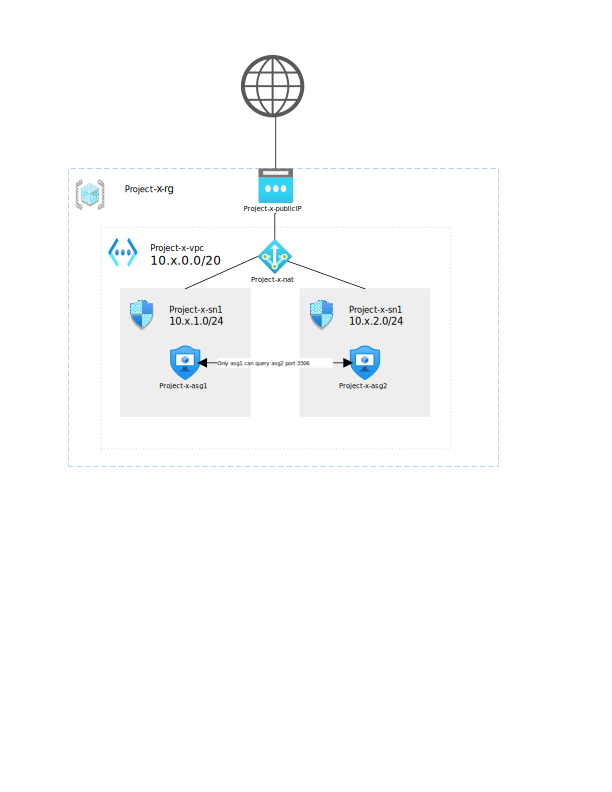

# TP Architecture d'un cloud

L'objectif du TP est de créer une architecture réseau avec 1 VPC et 2 subnets (app & db) avec la configuration de sécurité qui va bien. Le TP est réalisé sur AWS, Azure et GCP.

Un subnet est dédié au serveur applicatif et l'autre à la base de donnée.

Ci-dessous un schéma axé Azure

Chaque dossier porte le nom d'un cloud provider avec du code terraform pour déployer.

## Partie Ansible

TODO